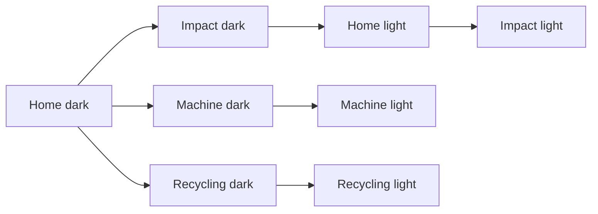

# 3awedlou · React Native mobile app

Native mobile application for the 3awedlou smart PET recycling machine.

Built with **React Native 0.86.3 + Expo SDK 57.0.25 + TypeScript 6.0.3** and
React Navigation v7 (bottom tabs + native stack). Device auth uses
`expo-secure-store` (hardware-backed, never plain AsyncStorage). Machine data
— telemetry, sessions, production, recycling — is fetched from the API; alerts
are derived from real machine state on the backend.

The app talks to the **same Symfony backend as the web app** — one API, one JWT
scheme, one contract (see [`../backend/docs/api-contract.md`](../backend/docs/api-contract.md)).

## Backend setup (first run)

1. Start the Symfony backend (see `../backend/README.md`) — by default on
   `http://127.0.0.1:8000`.
2. Copy `.env.example` to `.env` and point
   `EXPO_PUBLIC_API_BASE_URL` at your machine:
   - **Physical device (Expo Go):** use your PC's **LAN IP**, e.g.
     `http://192.168.1.109:8000/api` — on the phone, `localhost` is the phone
     itself. Find your IP with `ipconfig` (Windows) / `ip addr` (macOS/Linux).
   - **Android emulator:** `http://10.0.2.2:8000/api` maps to the host.
3. Restart the dev server after changing `.env` (values are embedded at start).

Dev accounts (loaded by backend fixtures, dev only): `anouer@3awedlou.app` /
`3awedlou-dev`.

## Run on your phone with Expo Go

1. Install **Expo Go**: Android (Play Store) or iOS (App Store).
2. Phone and PC on the **same Wi-Fi network** (or use the Android emulator).
3. Start the dev server (from this folder):

   ```bash
   npm start        # Expo dev server + QR code
   ```

4. Scan the QR code with the Expo Go app (Android) or the Camera app (iOS).

## Commands

| Command | What it does |
|---|---|
| `npm start` | Start the Expo dev server (Metro) with the QR code |
| `npm start -- -c` | Same as above, **after any `.env` change** (clears the Metro cache) |
| `npm run android` | Start + launch on a connected Android device/emulator |
| `npm run ios` | Start + launch in the iOS simulator (macOS only) |
| `npm run typecheck` | Strict TypeScript check (`tsc --noEmit`) |

> `npm start -- -c` is mandatory after editing `.env` — Expo embeds the env
> values into the bundle at start; a stale cache silently keeps the old values.

## Architecture

```text
mobile-app/                     (this repository)
├── App.tsx                     # Providers (Auth → Machine) + tab/stack navigation
├── api/
│   ├── client.ts               # fetch + Bearer token (secure store) + envelope + 401 flow
│   └── index.ts                # endpoint wrappers (auth, machines, telemetry, commands)
├── realtime/
│   └── realtimeService.ts      # connect/subscribe/onTelemetry — polling today, WS later
├── contexts/
│   ├── AuthContext.tsx         # login / register / session restore / single logout path
│   ├── MachineContext.tsx      # API-backed machine state (sensors, sessions, alerts)
│   └── ThemeContext.tsx        # light/dark/system theme
├── data/
│   ├── api.ts                  # API contract types (mirror of web-app/src/types/api.ts)
│   └── types.ts                # UI-only types + re-exports of the contract
├── pages/                      # Home, Machine, Recycling, Impact, Profile (+ History, Filament)
├── components/                 # Shell, SessionCard, ui kit, charts, icons
├── lib/                        # format, csv, storage
├── theme/                      # design tokens + theme modes
└── scripts/                    # generate-assets.py
```

Key rules:

* **One API contract** — `data/api.ts` mirrors the backend exactly; never invent
  field names locally.
* **Machine actions are guarded commands** — start/pause/resume/stop go through
  `POST /machines/{id}/commands`; the backend validates state and safe ranges
  before anything reaches hardware.
* **No fabricated data** — sensors show what the machine last reported; totals
  come from measured recycling records; estimates are labelled.
* **Honest realtime** — without a realtime URL the app polls every 10 s and says
  so in the UI; the `RealtimeService` interface is already the WebSocket
  contract.

## Polling / realtime (honest status)

`src/realtime/realtimeService.ts` runs an honest `REFRESH_MS = 10_000` (10 s)
poll of `GET /machines/{id}/dashboard` when `EXPO_PUBLIC_REALTIME_URL` is empty,
and labels the transport `polling` in the UI (Shell, Machine, Profile and about
sheets all say `10 s refresh`). There is **no WebSocket/SSE client**: the
`RealtimeService` interface is the contract the future transport will implement.

Known limitation: because the poll runs on a `setInterval`, a hidden tab
(real Android/iOS backgrounded app) stops the timer while the app is not in the
foreground and does not resume it automatically — the dashboard freezes while
the app is backgrounded. This is documented, not a bug.

## Screenshots



| Dark | Light |
|---|---|
|  |  |
|  |  |
|  |  |
|  |  |

Screenshots live in `docs/screenshots/` (see the "from assets/Screens-Photos"
note below). Export fresh ones with the repo's `scripts/generate-assets.py` and
place them here; the gallery displays the committed files.

## Prerequisites

| Tool | Version |
|---|---|
| Node.js | ≥ 18 |
| npm | ≥ 9 |

`package.json` declares no `engines` field; these are the versions used in this
checkout. Expo SDK 57.0.25 and React Native 0.86.3 are pinned by the lockfile.

## Configuration

| Variable | Required | Default | Meaning | Example placeholder |
|---|---|---|---|---|
| `EXPO_PUBLIC_API_BASE_URL` | yes | `http://YOUR_LAN_IP:8000/api` | Symfony API base; the same backend the web app uses | `http://YOUR_LAN_IP:8000/api` |
| `EXPO_PUBLIC_REALTIME_URL` | no | *(empty)* | WebSocket/SSE endpoint; empty = honest 10 s polling | `ws://127.0.0.1:8080/ws` |
| `EXPO_PUBLIC_ENVIRONMENT` | no | `development` | Shown in the UI footer, log verbosity | `production` |

No secrets are used by the client. `EXPO_PUBLIC_*` values are embedded in the
app bundle at start, so **never** put credentials here — nothing here is a
secret. Local overrides go in `.env` (git-ignored); committed files hold only
placeholders.

## Project structure

```text
.
├── assets/                     # app icons, splash, adaptive icon, favicon
├── components/                 # Shell (header + tab bar), SessionCard, charts, ui kit, icons
├── contexts/                   # Auth / Machine / Theme / Toast providers
├── data/                       # API contract types + UI-only types
├── lib/                        # date/format helpers, csv, async storage wrapper
├── pages/                      # Home, Machine, Recycling, Impact, Profile, History, Filament, Login
├── realtime/                   # RealtimeService (polling today, WS contract later)
├── scripts/                    # generate-assets.py
├── theme/                      # design tokens, theme modes
├── App.tsx                     # providers + navigation
├── index.ts
├── app.json
├── package.json
├── tsconfig.json
└── README.md
```

## Testing and quality

Client tests are **not** wired in this checkout: `npm test` is not defined.
Run `npm run typecheck` to validate the TypeScript. Linting is not configured.

## Troubleshooting

| Symptom | Likely cause | Fix |
|---|---|---|
| Phone cannot reach the API | Backend not reachable / wrong host | Set `EXPO_PUBLIC_API_BASE_URL` to the PC **LAN IP** (e.g. `http://192.168.1.109:8000/api`); phone and PC on the same Wi-Fi; backend must listen on all interfaces (`symfony serve --no-tls --allow-all-ip` or `php -S 0.0.0.0:8000`) |
| `localhost` works on phone | Wrong host | `localhost` on the phone resolves to the phone, not the PC — always use the LAN IP |
| Android emulator cannot reach backend | Wrong host | Use `http://10.0.2.2:8000/api` in `EXPO_PUBLIC_API_BASE_URL` |
| `npm start -- -c` does nothing | Dev server not restarted | Stop Metro and run `npm start -- -c` again after any `.env` change |
| Expo Go shows "Bundler not installed" | Stale bundle cache | Run `npm start -- -c` (clears cache); on physical devices also `expo start --dev-client` if using a dev client |
| Login rate limiter returns `429` | Too many failed logins | Wait `Retry-After` seconds, or disable the limiter in backend `config/packages/rate_limiter.yaml` for local debugging |
| `.env` with special characters breaks the app | Dotenv parses unquoted values | Quote passwords/URLs in `.env` |
| Image gallery shows broken images | Paths wrong relative to repo root | Paths in the README are relative to the repo root (`docs/screenshots/...`); clone the repo, not a subfolder |

## Security notes

* Device tokens are hashed at rest; API auth is JWT (RS256, 1 h TTL) with
  single-use refresh tokens, stored in `expo-secure-store`.
* Auth surface is rate-limited (login 5/5 min, register 3/10 min per IP).
* `EXPO_PUBLIC_*` values are **never** secrets — they are embedded in the
  bundle. No tokens, passwords, broker credentials or JWT keys are stored in
  this repo.
* Backend secrets (`.env.local`, JWT keys, broker passwords) are git-ignored.

## Roadmap

1. **Core API** — auth, machines, telemetry, sessions, production, recycling
   *(done, verified locally)*
2. **Guarded commands + audit** — backend-safe command dispatch
   *(done, verified locally)*
3. **MQTT broker integration** *(done and verified locally: telemetry in,
   commands out, ACL isolation, 503 when the broker is down)*
4. **ESP32 + Arduino Mega serial gateway** — planned; bench wiring exists,
   bench test pending, protocol not yet defined
5. **Device authentication** — device tokens
6. **Realtime transport** — WebSocket/SSE hub
7. **Push notifications**
8. **Admin back-office**
9. **Deployment** — automated builds, CI/CD, TLS
10. **Helpdesk / operation tooling**

**Current position:** phases 1–3 are done. Phases 4–10 are pending and
documented as TODO(anouer) markers in this README.

## Ecosystem

| Repo | Role | Stack | Link | Status |
|---|---|---|---|---|
| [`PET-Recycling-Filament-System-Backend`](https://github.com/AnouerChouikhgithub/PET-Recycling-Filament-System-Backend) | Shared Symfony API + MQTT backbone | PHP 8.3 + Symfony 7.4 + PostgreSQL 17 | https://github.com/AnouerChouikhgithub/PET-Recycling-Filament-System-Backend | Implemented (MQTT phase 3 verified locally) |
| [`PET-Recycling-Filament-System-Web`](https://github.com/AnouerChouikhgithub/PET-Recycling-Filament-System-Web) | Web dashboard (React 18 + Vite) | React 18 + Vite 5 + TS | https://github.com/AnouerChouikhgithub/PET-Recycling-Filament-System-Web | Implemented, polling transport |
| [`PET-Recycling-Filament-System-Mobile`](https://github.com/AnouerChouikhgithub/PET-Recycling-Filament-System-Mobile) | React Native mobile (Expo) | Expo SDK 57 + RN 0.86 | https://github.com/AnouerChouikhgithub/PET-Recycling-Filament-System-Mobile | Implemented, polling transport |
| `pet-recycling-filament-system` | Arduino + ESP32 hardware | C++ (Arduino) + TXS0108E + ESP32 | https://github.com/AnouerChouikhgithub/pet-recycling-filament-system | Hardware 3rd iteration; gateway planned |

## Related docs

* API contract: https://github.com/AnouerChouikhgithub/PET-Recycling-Filament-System-Backend/blob/main/docs/api-contract.md
* MQTT contract: https://github.com/AnouerChouikhgithub/PET-Recycling-Filament-System-Backend/blob/main/docs/mqtt-contract.md
* Web: https://github.com/AnouerChouikhgithub/PET-Recycling-Filament-System-Web/blob/main/README.md
* Backend: https://github.com/AnouerChouikhgithub/PET-Recycling-Filament-System-Backend/blob/main/README.md
* Hardware: https://github.com/AnouerChouikhgithub/pet-recycling-filament-system/blob/main/README.md

## License

TODO(anouer): no LICENSE file found in this repo — add one.
